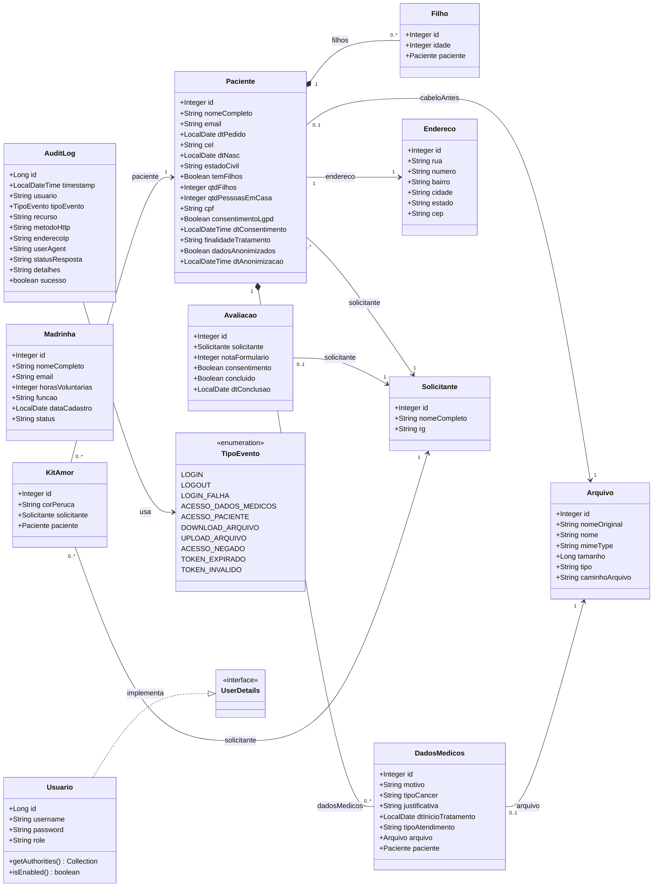

# Diagrama de classes

Este diagrama representa as entidades JPA do backend e os relacionamentos
declarados nas classes do pacote `entity` e em `security.audit`.

## Observacoes

- As cardinalidades foram inferidas das anotacoes JPA presentes no codigo.
- `Paciente` possui `@OneToMany` para `Filho` e `DadosMedicos`; as setas
  representam tambem o sentido da referencia mantida pelo modelo.
- `KitAmor`, `Avaliacao` e `DadosMedicos` possuem referencias para outras
  entidades, mas as classes relacionadas nao declaram necessariamente o lado
  inverso.
- `Madrinha` nao possui relacionamento JPA com as demais entidades.
- `Usuario` e `AuditLog` sao entidades independentes no mapeamento JPA. O
  campo textual `AuditLog.usuario` registra o identificador do usuario, sem
  uma associacao `@ManyToOne`.
- O diagrama nao inclui DTOs, controllers, services e repositories para manter
  o foco no modelo persistente.